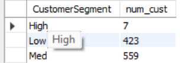
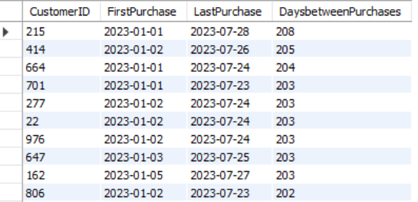
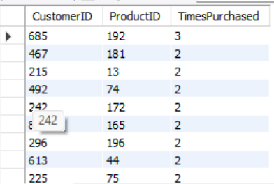
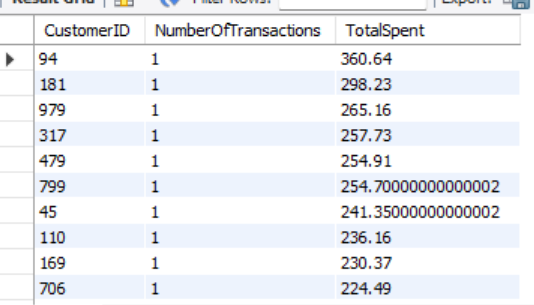
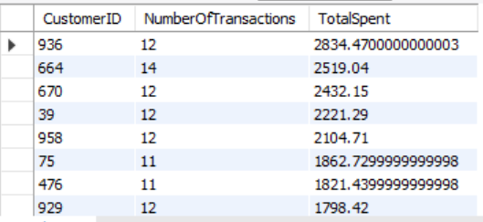

# Retail SQL Case Study 📊

## 📌 Project Overview
This project is an end-to-end **SQL-based retail analytics case study** focused on cleaning, transforming, and analyzing retail data to generate meaningful business insights.  
The analysis simulates real-world retail scenarios involving products, customers, and sales transactions using **MySQL**.

The project demonstrates practical SQL skills such as data cleaning, handling inconsistencies, and performing analytical queries to support business decision-making.

---

## 🗂️ Datasets Used
The case study is based on three relational tables:

### 1. Product Inventory
- ProductID  
- ProductName  
- Category  
- StockLevel  
- Price  

### 2. Customer Profile
- CustomerID  
- Age  
- Gender  
- Location  
- JoinDate  

### 3. Sales Transaction
- TransactionID  
- CustomerID  
- ProductID  
- QuantityPurchased  
- TransactionDate  
- Price  

---

## 🧹 Data Cleaning & Preparation
The following data quality issues were identified and resolved using SQL:

- Renamed incorrectly formatted column names
- Checked and handled duplicate records
- Identified and fixed null, blank, and invalid values
- Imputed missing customer locations using the mode
- Corrected outliers in:
  - Customer age
  - Product pricing
- Converted text-based date columns to proper DATE format
- Removed duplicate sales transactions

These steps ensured the data was consistent, accurate, and analysis-ready.

---

## 📈 Business Questions Answered
The analysis answers key business and analytical questions such as:

- What are the total units sold and total revenue per product?
- Which customers purchase most frequently?
- Which product categories generate the highest sales?
- What are the top-performing and least-performing products?
- How do sales trend over time (daily and monthly)?
- What is the month-on-month sales growth?
- Who are the high-value customers?
- Which customers are low-frequency buyers?
- Which customers show repeat purchase behavior?
- How loyal are customers based on first and last purchase dates?
- How can customers be segmented based on purchase quantity?


## 📊 Advanced SQL Analysis — Key Queries & Insights

This section highlights five important analytical SQL queries performed on the retail dataset.
Each query includes:
- Clean SQL
- Output summary
- Business interpretation
- Screenshot of the result

🔹 Query 58 —  Customer Segmentation Based on Purchase Quantity

```
WITH customer_segment AS (
    SELECT 
        c.CustomerID,
        CASE
            WHEN SUM(s.QuantityPurchased) BETWEEN 1 AND 10 THEN 'Low'
            WHEN SUM(s.QuantityPurchased) BETWEEN 11 AND 30 THEN 'Med'
            ELSE 'High'
        END AS CustomerSegment
    FROM customer_profile c
    INNER JOIN sales_transaction s
        ON c.CustomerID = s.CustomerID
    GROUP BY c.CustomerID
)
SELECT 
    CustomerSegment,
    COUNT(*) AS num_cust
FROM customer_segment
GROUP BY CustomerSegment
ORDER BY CustomerSegment;
```



### **Insight**
- A very small High segment (7 customers) indicates a classic Pareto pattern — a tiny group drives a large share of revenue.
- Most customers fall into Low and Medium segments, ideal for targeted marketing.

---

🔹 Query 57 — Customer Lifecycle: First vs Last Purchase Gap

```
SELECT 
    CustomerID,
    MIN(TransactionDate) AS FirstPurchase,
    MAX(TransactionDate) AS LastPurchase,
    DATEDIFF(MAX(TransactionDate), MIN(TransactionDate)) AS DaysbetweenPurchases
FROM sales_transaction
GROUP BY CustomerID
HAVING DaysbetweenPurchases > 0
ORDER BY DaysbetweenPurchases DESC;
```



### **Insight**
 - Customers with long active durations (200+ days) show strong retention.
 - This query helps identify loyal customers and estimate Customer Lifetime Value (CLV).

---

🔹 Query 56 — Repeat Purchase Behavior (Customer × Product)

```
SELECT 
    CustomerID,
    ProductID,
    COUNT(*) AS TimesPurchased
FROM sales_transaction
GROUP BY CustomerID, ProductID
HAVING COUNT(*) > 1
ORDER BY TimesPurchased DESC;
```



### **Insight**
- Repeat purchases indicate product satisfaction and loyalty.
- Products with high repeat frequency should be prioritized for inventory planning and promotions.

---

🔹 Query 55 —  Low‑Frequency Customers (≤ 2 Transactions)

```
SELECT 
    CustomerID,
    COUNT(*) AS NumberOfTransactions,
    SUM(QuantityPurchased * Price) AS TotalSpent
FROM sales_transaction
GROUP BY CustomerID
HAVING COUNT(*) <= 2
ORDER BY NumberOfTransactions ASC, TotalSpent DESC;
```



### **Insight**
- These are high‑value but low‑frequency buyers.
- They are ideal targets for re‑engagement campaigns to increase repeat purchases.
  
---

🔹 Query 54 — High‑Value Customers (Frequent Buyers + High Spend)

```
SELECT 
    CustomerID,
    COUNT(*) AS NumberOfTransactions,
    SUM(QuantityPurchased * Price) AS TotalSpent
FROM sales_transaction
GROUP BY CustomerID
HAVING COUNT(*) > 10 
   AND TotalSpent > 1000
ORDER BY TotalSpent DESC;
```



### **Insight**
- These customers form the core loyal base.
- They should be prioritized for:
  - Loyalty programs
  - Exclusive offers
  - Personalized recommendations
  - They contribute heavily to overall revenue.

---

## 🧠 Key Insights
- A small group of customers contributes significantly to total revenue
- Certain product categories consistently outperform others
- Pricing and data-entry errors can heavily impact revenue analysis if not corrected
- The majority of customers fall into low or medium purchase segments
- Clear sales trends and seasonality patterns are observable over time
- Customer segmentation enables targeted marketing strategies

---

## 🛠️ Tools & Technologies
- **MySQL**
- SQL (DDL, DML, Joins, CTEs, Window Functions)
- Data Cleaning & Exploratory Data Analysis (EDA)

---

## 📂 Repository Structure
```text
Retail-SQL-Case-Study/
│
├── Case Study@retail analytics.sql   # Complete SQL script
├── README.md                         # Project documentation

---

✅ Conclusion
This project showcases how SQL can be effectively used to clean raw retail data and transform it into actionable business insights.
It reflects real-world data challenges and demonstrates analytical thinking, problem-solving, and strong SQL fundamentals.

👤 Author
Vaibhav Chouhan
Aspiring Data Analyst | SQL & Retail Analytics Enthusiast

⭐ If you find this project helpful, feel free to star the repository!
